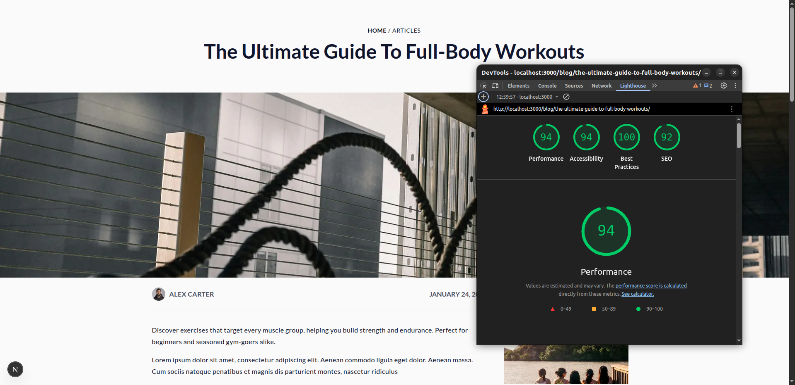

# Blog Management System

A modern, full-featured Blog CMS built with Next.js 16 that provides comprehensive content management capabilities for creating, managing, and publishing blog posts with rich media support.

<div align="center">
  
</div>

## ✨ Features

### Content Management

- 📝 **CRUD Operations** - Full lifecycle management for blog posts
- 🎨 **Rich Text Editor** - React Quill WYSIWYG editor with formatting
- 🖼️ **Image Support** - Banner images and multi-image galleries with Next.js optimization
- 💾 **Draft System** - Save and manage draft posts before publishing

### User Engagement

- ⭐ **Ratings System** - Star-based rating system for blog posts
- 💬 **Comments** - Full commenting system with nested replies support
- 🗣️ **Testimonials** - Display user testimonials and feedback

### Organization & Discovery

- 🏷️ **Tags & Categories** - Multi-tag support and hierarchical categories
- 🔍 **Search & Filter** - Filter blogs by categories, tags, and criteria
- 🧭 **Breadcrumbs** - Navigation breadcrumbs with structured data

### Technical Features

- ⚡ **Server Actions** - Next.js 16 server-side operations for data mutations
- ✅ **Form Validation** - Zod schema validation with Formik integration
- 🔄 **State Management** - Redux Toolkit for global state
- 📱 **SEO Optimized** - Structured data, meta tags, sitemaps, robots.txt
- 🎯 **Responsive Design** - Tailwind CSS 4 with mobile-first approach
- 🔒 **Type Safety** - Full TypeScript implementation with strict mode

## 🚀 Quick Start

```bash
npm install
npm run dev
```

Open [http://localhost:3000](http://localhost:3000)

**Available Commands:**

- `npm run dev` - Start development server
- `npm run build` - Create production build
- `npm start` - Start production server
- `npm run lint` - Run ESLint checks
- `npm run lint:fix` - Fix ESLint issues automatically
- `npm run typecheck` - TypeScript type checking
- `npm run format` - Format code with Prettier

## 📁 Project Structure

```
Blog-Managment-System-main/
├── src/
│   ├── app/                      # Next.js App Router
│   │   ├── (blog)/              # Public blog pages (route group)
│   │   │   ├── page.tsx         # Homepage
│   │   │   └── blogs/           # Blog listing & detail
│   │   │       └── [slug]/      # Dynamic blog detail route
│   │   ├── (dashboard)/         # Admin dashboard (route group)
│   │   │   ├── layout.tsx       # Dashboard layout
│   │   │   ├── blogs/           # Blog management
│   │   │   │   ├── page.tsx     # Blog list/management
│   │   │   │   └── actions.ts   # Server actions for CRUD
│   │   │   ├── dashboard/       # Dashboard home
│   │   │   └── settings/        # Settings pages
│   │   ├── layout.tsx           # Root layout with providers
│   │   ├── globals.css          # Global styles
│   │   ├── actions.ts           # Global server actions
│   │   └── [SEO files]          # sitemap.ts, robots.ts, manifest.ts
│   ├── components/
│   │   ├── blog/                # Blog-specific components
│   │   │   ├── blogDetail/      # Blog detail page components
│   │   │   │   ├── BlogCommentForm.tsx
│   │   │   │   ├── BlogContent.tsx
│   │   │   │   └── BlogData.tsx
│   │   │   ├── blogCard.tsx
│   │   │   ├── blogForm.tsx
│   │   │   └── BlogList.tsx
│   │   ├── ui/                  # Reusable UI components
│   │   │   ├── button.tsx
│   │   │   ├── StarRating.tsx
│   │   │   ├── ToastContainer.tsx
│   │   │   └── MultiSelect.tsx
│   │   ├── forms/               # Form components
│   │   ├── layouts/             # Layout components (header, footer)
│   │   ├── common/              # Common utilities
│   │   ├── seo/                 # SEO components
│   │   └── providers/           # Context providers
│   ├── lib/
│   │   ├── data/                # Data layer
│   │   │   ├── blogs.json       # Blog posts data store
│   │   │   ├── comments.json    # Comments data store
│   │   │   ├── blog-repository.ts
│   │   │   └── comment-repository.ts
│   │   ├── store/               # Redux state management
│   │   │   ├── index.ts         # Store configuration
│   │   │   ├── authSlice.ts
│   │   │   └── Provider.tsx
│   │   ├── hooks/               # Custom React hooks
│   │   │   ├── useToast.ts
│   │   │   ├── useDebounce.ts
│   │   │   └── useOutsideClick.ts
│   │   ├── validations/         # Zod validation schemas
│   │   ├── utils/               # Utility functions
│   │   ├── seo/                 # SEO utilities
│   │   └── SVGIcons/            # SVG icon system
│   ├── types/                   # TypeScript type definitions
│   │   ├── blog.ts
│   │   └── icon.ts
│   ├── config/                  # Configuration files
│   │   ├── env.ts               # Environment variables
│   │   ├── metadata.ts          # SEO metadata
│   │   └── site.ts              # Site configuration
│   └── constants/               # Application constants
├── public/
│   └── images/                  # Static image assets
│       ├── Blog/
│       └── svg/
├── .amazonq/                    # Amazon Q configuration
│   └── rules/
│       └── memory-bank/         # Project documentation
└── [config files]               # Root configuration files
```

## 🎯 Usage

### Public User Journey

**Homepage:** [http://localhost:3000](http://localhost:3000)

- Browse featured blog posts
- Explore categories and tags

**Blog Listing:** [/blogs](http://localhost:3000/blogs)

- View all published blog posts
- Filter by categories and tags
- Search and discover content

**Blog Detail:** Click any blog post

- Read full content with rich text formatting
- View banner and gallery images
- Rate the blog post (1-5 stars)
- Leave comments and engage

### Admin User Journey

**Dashboard:** [/dashboard/blogs](http://localhost:3000/dashboard/blogs)

- View all blog posts (published & drafts)
- Create new blog posts with rich text editor
- Upload banner and gallery images
- Set categories, tags, and metadata
- Edit existing posts
- Delete posts
- Publish or save as draft

## 🛠 Tech Stack

### Core Technologies

- **Framework:** Next.js 16.1.4 (App Router, Server Components, Server Actions)
- **UI Library:** React 19.2.3
- **Language:** TypeScript 5.x (strict mode)
- **Styling:** Tailwind CSS 4.x

### State & Forms

- **State Management:** Redux Toolkit 2.11.2, React Redux 9.2.0
- **Form Management:** Formik 2.4.9
- **Validation:** Zod 4.3.6, zod-formik-adapter 2.0.0

### UI Components & Assets

- **Rich Text Editor:** react-quill-new 3.7.0
- **Icons:** lucide-react 0.563.0
- **Carousel:** Swiper 12.0.3
- **Utilities:** clsx 2.1.1, tailwind-merge 3.4.0

### Development Tools

- **Linting:** ESLint 9.x, eslint-config-next 16.1.4
- **Formatting:** Prettier 3.4.2, prettier-plugin-tailwindcss 0.7.2
- **Build:** PostCSS, @svgr/webpack 8.1.0

### Data Storage

- **File-based:** JSON files (blogs.json, comments.json)
- **Repository Pattern:** Abstraction layer for data access

## 🏗️ Architecture Patterns

- **App Router:** Route groups for logical separation
- **Server Components:** Default for optimal performance
- **Client Components:** Only when needed for interactivity
- **Server Actions:** Server-side mutations in actions.ts files
- **Repository Pattern:** Data access abstraction layer
- **Feature-based Organization:** Components grouped by feature

## 📝 Key Features Implementation

### Form Validation

- Zod schemas for type-safe validation
- Field-level and form-level validation
- Touch tracking for error display
- Real-time validation feedback

### SEO Optimization

- Next.js Metadata API
- JSON-LD structured data
- Dynamic sitemaps and robots.txt
- Open Graph and Twitter cards

### Performance

- Server Components by default
- Image optimization with Next.js Image
- Code splitting and lazy loading
- React memo and useMemo for optimization

## 📄 Author

Built by **Meet Gadhiya**

## 📄 License

This project is open source and available under the MIT License.
